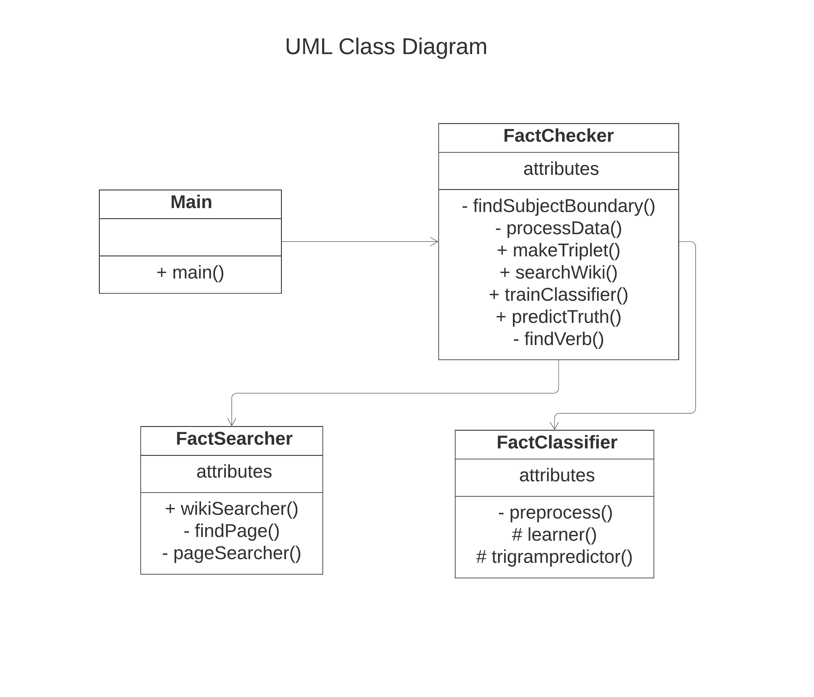
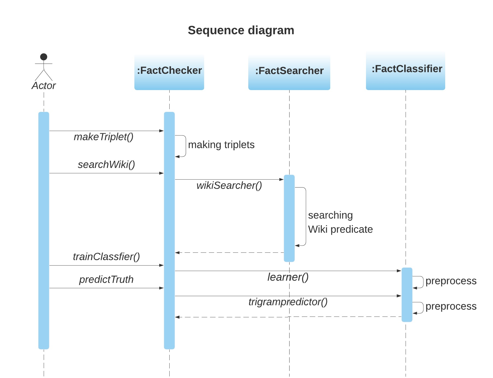

# Simple Fact Checker

Goal : Build a corpus-driven fact-checking engine, which returns a veracity value between 0 (fact is false) and +1 (fact is true) given a fact from Wikipedia.

While running this program, be sure to include the provided jar files in classpath. 

If you want, you can change training and test filenames in FactChecker.java

The program is designed to run with JDK 8 and above. 

# Role of each file
* Main.java is the entry point of the program 
* FactChecker.java makes <Subject, Object, Predicate> triplet and handles the other classes
* FactSearcher.java takes a triplet, performs web search for the given subject and returns matching predicate for the provided object, if available. 
* FactClassifier.java assigns a truth-value to a fact by matching provided predicate and web predicate. 

# Steps to Execute
* For Windows Users - 
1. &gt; git clone https://github.com/Pritilata95/SimpleFactChecker
2. &gt; cd SimpleFactChecker
3. &gt; javac -cp "./lib/\*;./src/\*" -d bin ./src/\*.java
4. &gt; java -cp "./lib/\*;./bin" Main

* For Linux Users - 
1. $ git clone https://github.com/Pritilata95/SimpleFactChecker
2. $ cd SimpleFactChecker
3. $ javac -cp "./lib/\*:./src/\*" -d bin ./src/\*.java
4. $ java -cp "./lib/\*:./bin" Main

# Diagrams

  
  

